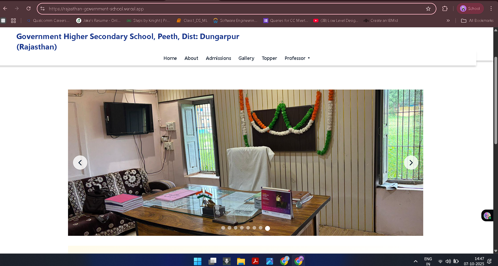
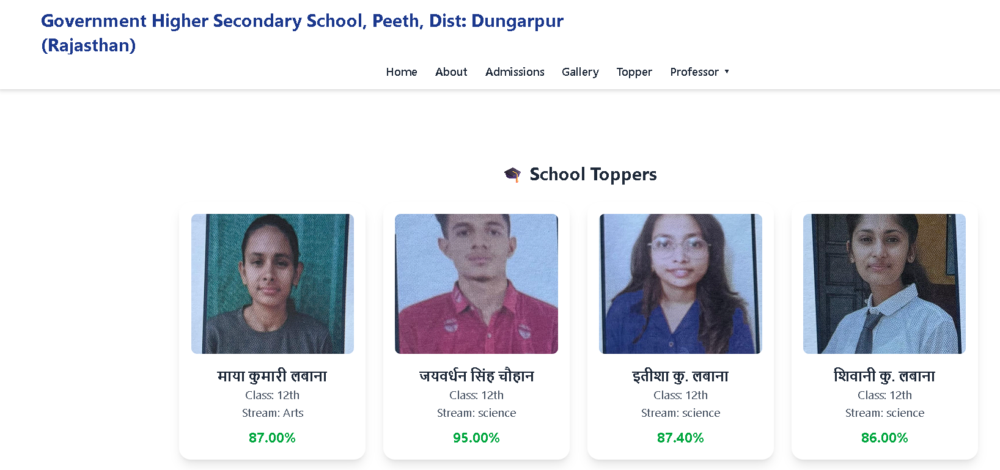
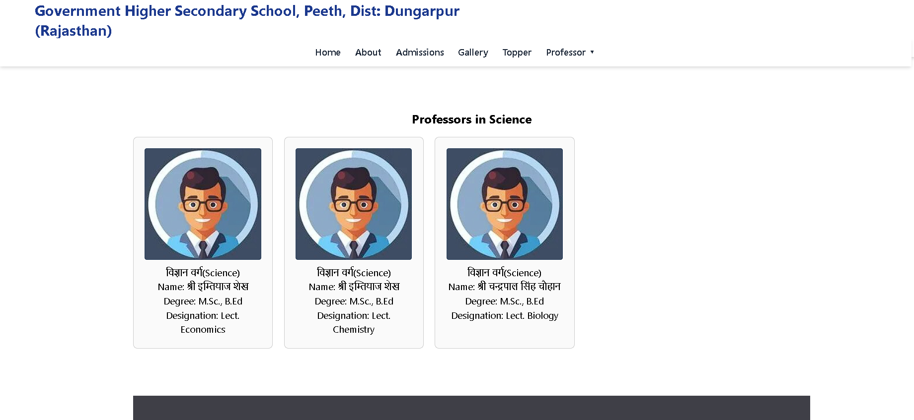
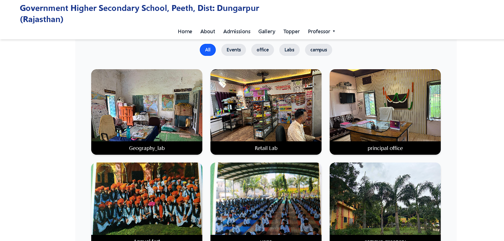
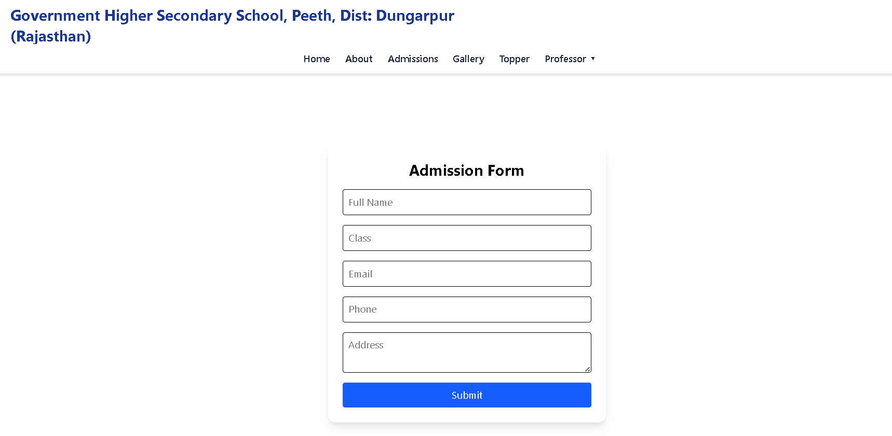

# Rajasthan Government School Website  

A full-stack web application for **Government Higher Secondary School, Peeth, Dist: Dungarpur (Rajasthan)** showcasing professors, toppers, admissions, and campus gallery.  

🔗 **Live Demo:** [rajasthan-government-school.vercel.app](https://rajasthan-government-school.vercel.app/)  
📂 **Repository:** [GitHub Repo](https://github.com/amitk2003/Rajasthan-government-school)  

---

## 🚀 Project Overview  
This project was developed as a freelancing work for a **Government School in Rajasthan**.  
The goal was to create a **complete school website** that is responsive, dynamic, and easy to use across all electronic devices.  

The website includes:  
- **Home, About, Admissions** pages.  
- **Professor Section** – Data stored in MongoDB (Name, Degree, Specialization, Designation).  
- **Topper Section** – Student achievement records managed via backend API.  
- **Gallery Section** – Filterable images (Labs, Campus, Events, Office).  
- **Admission Form** – Fully functional form connected to backend & database for student registration.  

---

## 🛠️ Tech Stack  

### **Frontend:**  
- React.js  
- Tailwind CSS  
- Framer Motion (animations & transitions)  
- HTML5, CSS3  

### **Backend:**  
- Node.js  
- Express.js  
- Multer (for file uploads)  

### **Database:**  
- MongoDB (Atlas Cloud for storing professors, toppers, and admissions data)  

---

## 📂 Features  

- 🎓 **Professor Section:**  
  - Displays faculty info (Name, Degree, Specialization, Designation).  
  - Data dynamically fetched from MongoDB.  

- 🏆 **Topper Section:**  
  - Stores topper details with degree/year.  
  - Data stored in MongoDB Atlas and rendered dynamically.  

- 🖼️ **Gallery Section:**  
  - Filterable categories (Labs, Campus, Events, Office).  
  - Responsive card-based image display.  

- 📝 **Admission Form:**  
  - Connected with backend API and MongoDB Atlas.  
  - Stores student admission details in database.  

- 🎨 **Modern UI:**  
  - Built using Tailwind CSS for responsive design.  
  - Framer Motion for smooth animations & interactive effects.  

- 📱 **Responsive Design:**  
  - Fully optimized for mobile, tablet, and desktop.  

---

## ⚡ How I Built the Project  

1. **Frontend Setup:**  
   - Bootstrapped React app.  
   - Created reusable components (Navbar, Footer, Gallery, Professors, Toppers, Admission Form).  
   - Styled with **Tailwind CSS**.  
   - Added animations with **Framer Motion**.  

2. **Backend Setup:**  
   - Configured Express server with routes for Professors, Toppers, and Admissions.  
   - Used Multer for file uploads (e.g., topper images).  

3. **Database Integration:**  
   - Created MongoDB Atlas cluster.  
   - Designed schemas for Professors, Toppers, and Admissions.  

4. **Deployment:**  
   - Frontend deployed on **Vercel**.  
   - Backend connected with **MongoDB Atlas** for data storage.  

---

## 📸 Screenshots  

### CAROUSEL Section  

### Topper Section  

### professor Section  
 

### Gallery Section  
  

### Admission Form  
  

---

## 📌 Future Improvements  
- Add **Admin Dashboard** for CRUD operations (Professors, Toppers, Admissions).  
- Add **Authentication** for admin login.  
- Integrate **Email Notifications** on admission form submission.  

---

## 👨‍💻 Author  
**Amit Kumar**  
- GitHub: [amitk2003](https://github.com/amitk2003)  
